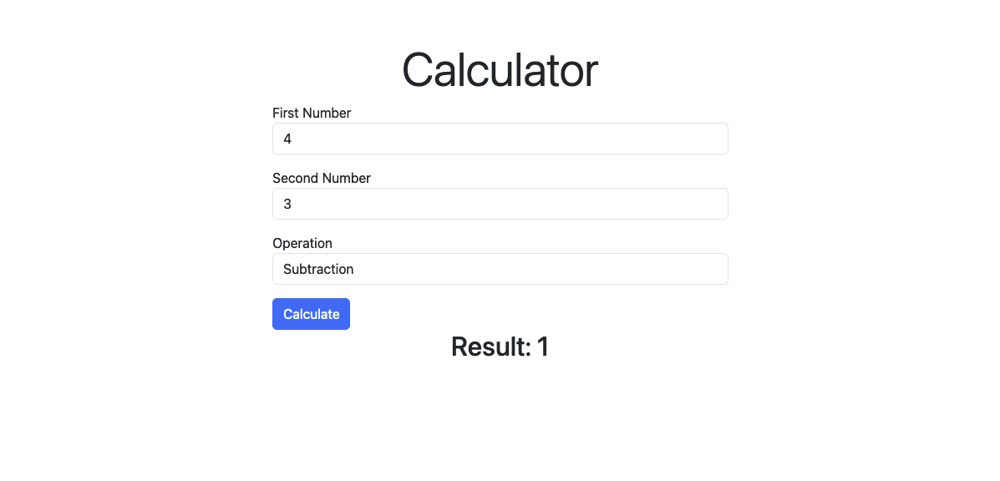

# Symfony Calculator

A simple Calculator using Symfony 7.

## Project overview

This project is a simple calculator that can perform basic arithmetic operations like addition, subtraction, multiplication, and division.

## Requirements/ specs

- Creating a standalone project using Symfony-cli
- Name the project
- Writing a controller inside src/Controller
- Adding a form to handle calculator operations (e.g. additon, subtraction etc)
- Creating a twig file in the template folder
- Updating controller to handle the form submission and calculate the result
- Keeping it simple

### Tech Stack


- Composer
- Symfony CLI
- Twig

## Project view



### How To Run

1. Clone the repository
    ```bash
    git clone https://github.com/the-sankari/symfony_calculator.git
    ```
2. Navigate to the project 
    ```bash
   cd symfony_calculator
   ```
2. Install dependency

   ```bash
   composer install
   ```

3. Start the application locally
   ```bash
   symfony serve
   ```
4. Open your browser and navigate to `http://localhost:8000/calculator`
5. Fill the form with the required values and submit it
6. The result will be displayed on the same page
7. You can perform different operations by changing the values in the form

### Assigned by

- [Santosh Kalwar](https://github.com/kalwar) (Software Development Teacher, Business College, Helsinki )

### Author

- [Kajol Sutra Dhar](https://github.com/kalwar)

### Licence

[](https://opensource.org/licenses/MIT)

Open to use for learning purpose.
